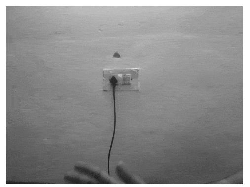
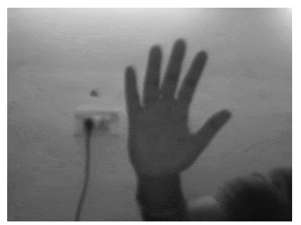
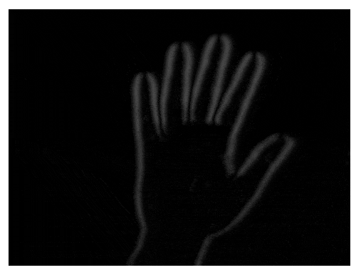
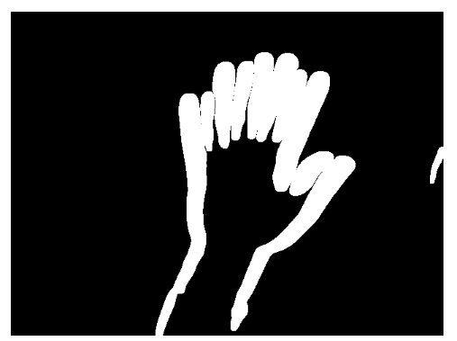
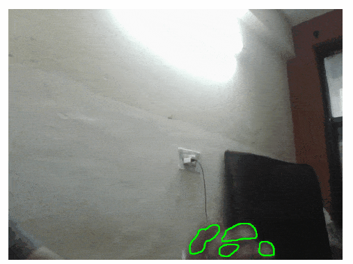

## (MASS) Motion Activated Surveillance System

### Black and white Conversion

### Blurring the video to reduce noise if any

### Compute absolute Difference 

 

### Calculate Threshold

### Calculating and Drawing Contours

* If the area of the contour is more than the specified threshold it treats it as motion.

